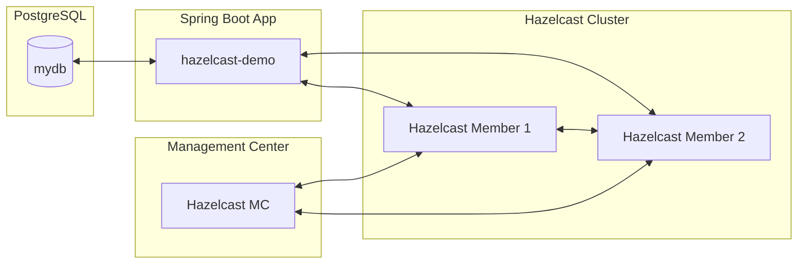

# Hazelcast Demo 🚀

A **Spring Boot 3 + Hazelcast 5.5 + PostgreSQL 15** demo project.  
This project demonstrates how to integrate Hazelcast as a distributed caching solution in a Spring Boot application, with Dockerized infrastructure for PostgreSQL, Hazelcast cluster, and Hazelcast Management Center.

---

## 📌 Features
- Spring Boot **3.5.4** (Java 21)
- Hazelcast **member cluster** (2 nodes) with client configuration
- Hazelcast **Management Center** for cluster monitoring
- PostgreSQL database integration
- Spring Data JPA for persistence
- Docker + Docker Compose setup for local development
- REST API ready for caching use cases

---

## 📂 Project Structure
```bash
hazelcast-demo/
│── src/main/java/...          # Spring Boot source code
│── src/main/resources/
│    ├── application.properties
│    ├── hazelcast.xml         # Hazelcast member config
│    ├── hazelcast-client.yml  # Hazelcast client config
│── Dockerfile                 # Spring Boot container
│── docker-compose.yml         # Multi-service setup
│── pom.xml                    # Maven dependencies
```

---

## ▶️ Getting Started

### 1. Clone the repository
```bash
git clone https://github.com/rizkiauliasa/hazelcast-demo.git
cd hazelcast-demo
```

### 2. Build the application
```bash
mvn clean package -DskipTests
```

### 3. Run with Docker Compose
```bash
docker-compose up --build -d
```

### 4. Access services
- **Spring Boot App** → http://localhost:9990  
- **Hazelcast Management Center** → http://localhost:8443  
- **Hazelcast Members** run inside containers
- **PgAdmin** → [http://localhost:8889](http://localhost:8889)  
  - **Login with:**  
    - Email: `admin@admin.com`  
    - Password: `admin`  
  - **Add a new connection in pgAdmin:**  
    - Host: `postgres-hazelcast` (container name, since pgAdmin is in the same Docker network)  
    - Port: `5432`  
    - Username: `myuser`  
    - Password: `mypass`  
    - Database: `mydb`

---

## 🏗️ Architecture Diagram



---
